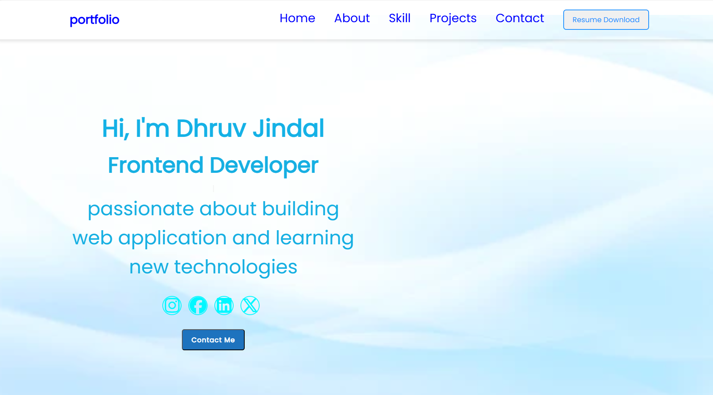

# 🚀 CodSoft Web Development Internship

# Hi 👋, I'm Dhruv Jindal

### 💻 Computer Science Engineering Student | Frontend Web Developer

I am passionate about creating responsive, user-friendly websites and continuously improving my frontend development skills.

---

# 👨‍💻 About Me

- 🎓 B.Tech CSE Student
- 🌱 Currently Learning Java Full Stack Development
- 💻 Passionate about Frontend Development
- 🚀 Looking for Internship Opportunities
- 📍 India

---

# 🛠 Tech Stack

- HTML5
- CSS3
- JavaScript
- Java
- Git
- GitHub

---

# 📂 Projects

## 🌐 Task 1 – Personal Portfolio Website

### Description

A responsive portfolio website built using HTML, CSS and JavaScript.

### Features

- Responsive Design
- About Me
- Skills
- Projects
- Contact Form
- Resume Download

📸 Screenshot

📂 Project Folder

`Task-1-Portfolio`

---

## 🎨 Task 2 – Landing Page

### Description

A responsive Landing Page created using HTML and CSS.

### Features

- Hero Section
- Navigation Bar
- Responsive Layout
- Modern UI

📸 Screenshot

📂 Project Folder

`Task-2-Landing-Page`

---

## 🧮 Task 3 – Calculator

### Description

A Calculator built using HTML, CSS and JavaScript.

### Features

- Addition
- Subtraction
- Multiplication
- Division

📸 Screenshot

📂 Project Folder

`Task-3-Calculator`

---

# 💻 Technologies Used

- HTML5
- CSS3cd 
- JavaScript

---

# 📞 Contact Me

**Name:** Dhruv Jindal

📧 Email:
jindaldhruv442@gmail.com

📱 Phone:
+91 8791582052

💼 LinkedIn:
https://www.linkedin.com/in/dhruv-jindal-1a8216423

💻 GitHub:
https://github.com/DHRUVJINDAL-0101

---

# ⭐ Repository

This repository contains all the projects completed during my CodSoft Web Development Internship.

Thank you for visiting my repository.

⭐ If you like my work, don't forget to Star this repository.

---

© 2026 Dhruv Jindal